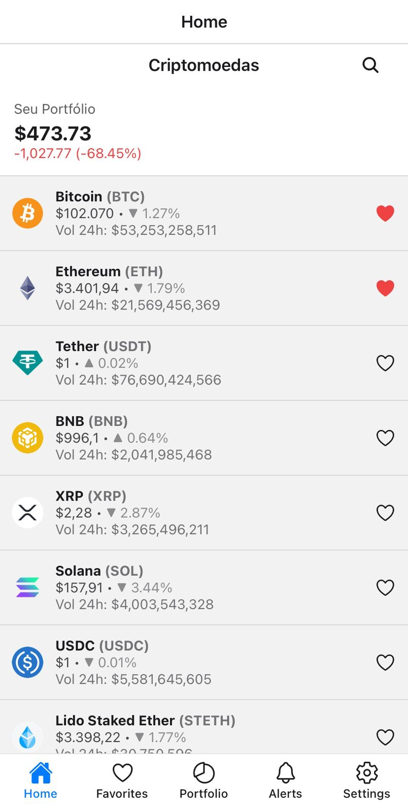
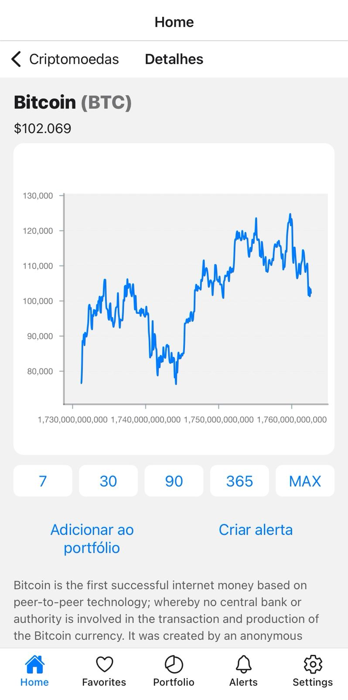
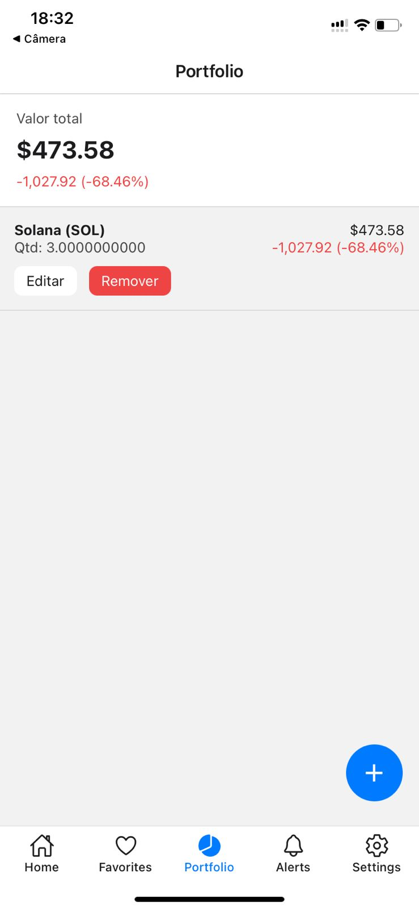
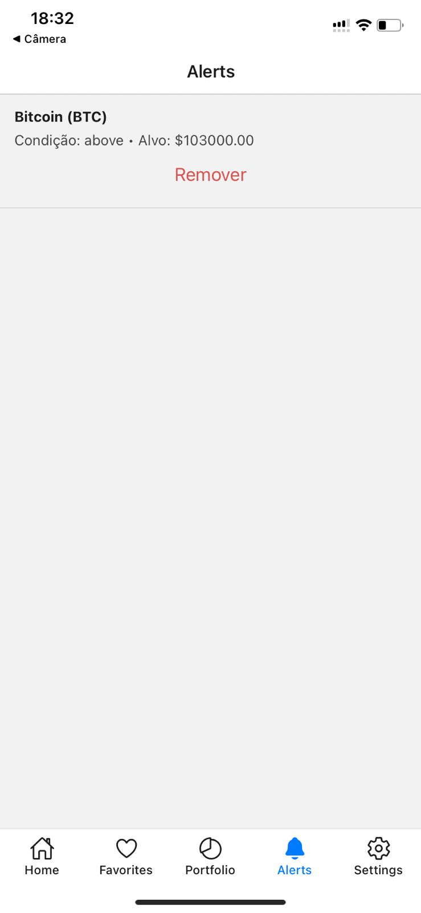

# 📱 CryptoTracker (Frontend)

> App mobile (Android) para rastrear criptomoedas, gerir portfólio e alertas de preço.

Este repositório contém o frontend em React Native/Expo, integrado ao backend Django/DRF.

## ✨ Principais recursos

- ✅ Autenticação completa (login/registro/refresh) com interceptors
- 📋 Lista de moedas com paginação infinita e busca
- 📊 Gráficos históricos e estatísticas detalhadas
- ❤️ Sistema de favoritos sincronizado
- 💼 Portfólio com cálculo de P/L
- 🔔 Alertas de preço personalizados
- 🌓 Tema claro/escuro global

## 🧱 Stack

- **React Native** (Expo)
- **TypeScript**
- **React Navigation** v6 (Bottom Tabs + Stacks)
- **TanStack Query** v5
- **Zustand** (auth/settings state)
- **Axios** (com interceptors JWT)
- **Victory Native** (gráficos)
- **MMKV** (persistência)

## 📁 Estrutura do projeto

```
.
├─ assets/                    # Recursos estáticos
├─ src/
│  ├─ api/                   # Configuração Axios
│  ├─ components/            # Componentes reutilizáveis
│  ├─ hooks/                 # Custom hooks (React Query)
│  ├─ navigation/            # Navegação (tabs/stacks)
│  ├─ screens/               # Telas principais
│  ├─ store/                 # Estado global (Zustand)
│  ├─ theme/                 # Tema e estilos
│  └─ utils/                 # Helpers
└─ App.tsx                   # Entry point
```

## 🚀 Como rodar

1. **Instalar dependências**
```bash
npm install
# ou
yarn
```

2. **Configurar .env**
```env
API_URL=http://10.0.2.2:8000  # Emulador
# ou
API_URL=http://SEU_IP:8000    # Device físico
```

3. **Rodar o app**
```bash
npx expo start --tunnel
```

## 🔌 Endpoints principais

```typescript
const endpoints = {
  auth: {
    login: '/auth/login/',
    register: '/auth/register/',
    refresh: '/auth/refresh/',
  },
  coins: {
    list: '/coins/',
    details: (id: string) => `/coins/${id}/`,
    chart: (id: string) => `/coins/${id}/chart/`,
  },
  // ...outros endpoints
}
```

## 📸 Screenshots

### 🏠 Home


### 📈 Detalhes da Moeda


### 💼 Portfólio


### 🔔 Alertas


## 🛣️ Roadmap

- [ ] Push notifications (FCM)
- [ ] Deep linking
- [ ] Autenticação biométrica
- [ ] Testes E2E
- [ ] Melhorias de acessibilidade

## 📝 Licença

MIT

---
Desenvolvido por [Seu Nome](https://github.com/seu-usuario)
